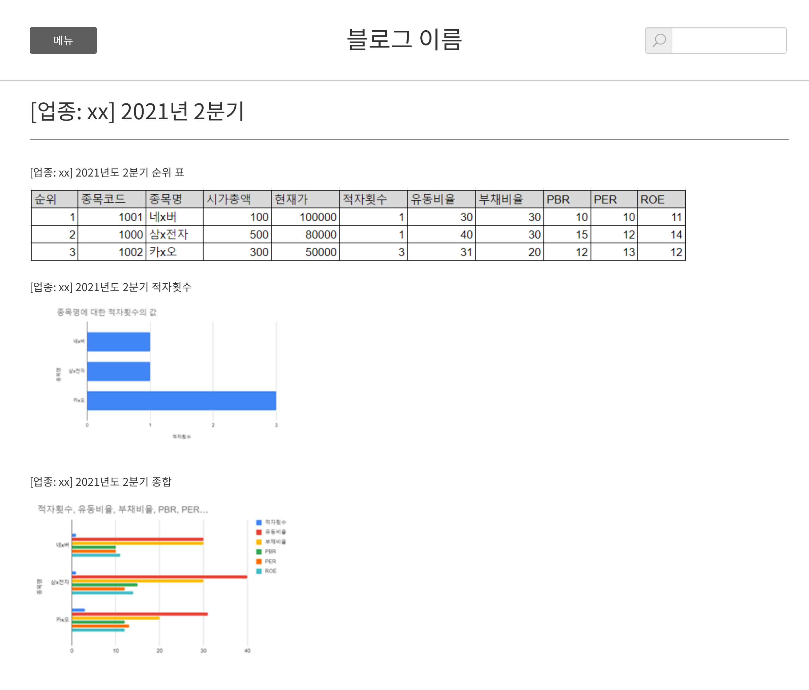
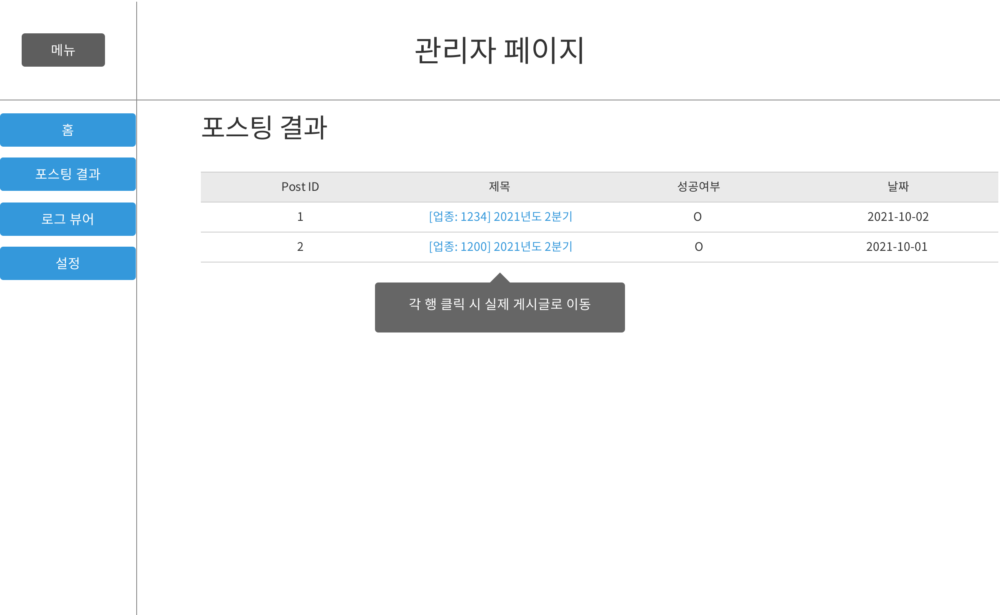
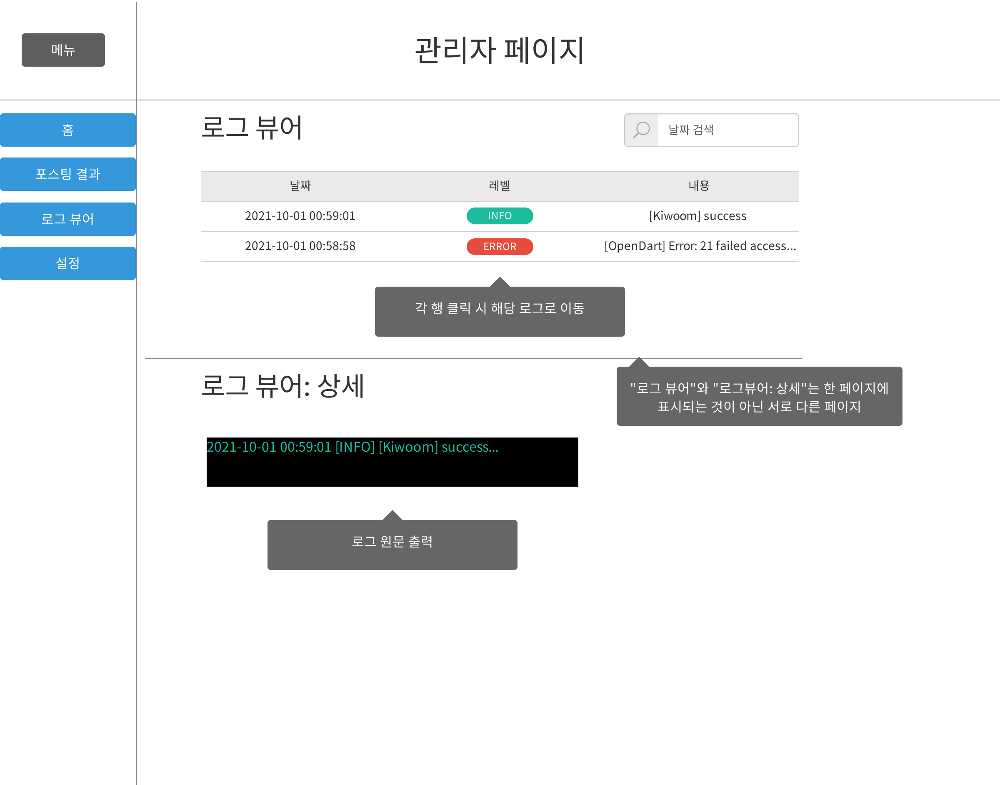
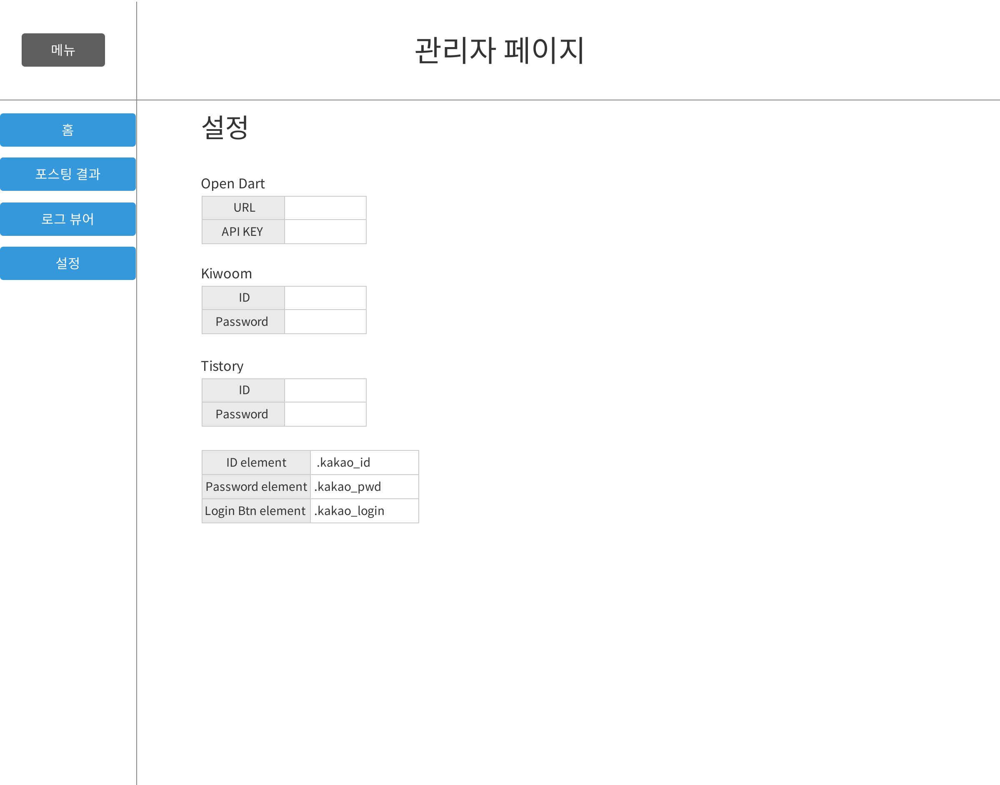
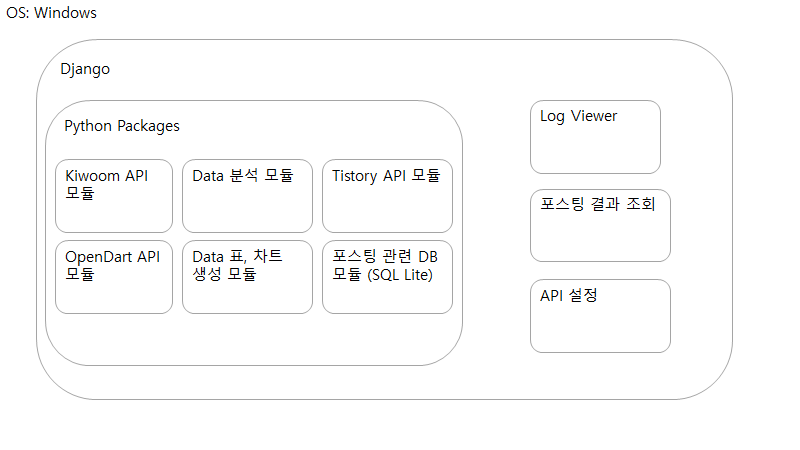
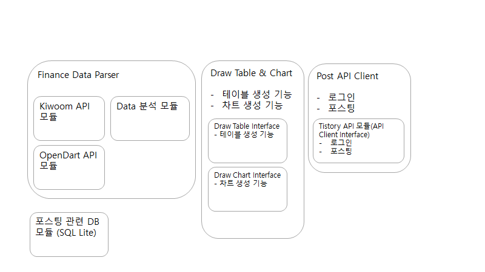
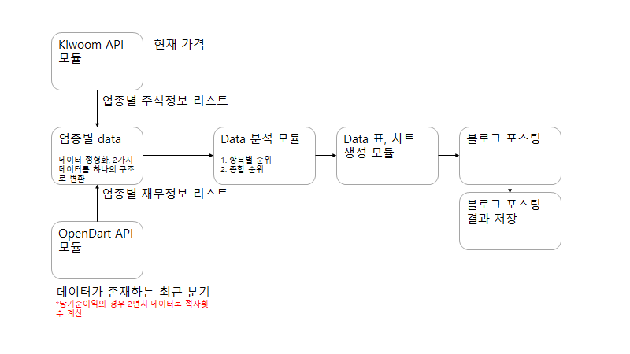

# Finance Data Automatic Posting With Python

## 주식 정보 자동 포스팅 파이썬

## 개요

**배경**: 
코로나로 인한 팬데믹으로 전 세계가 경제적으로 힘든 시기를 보내고 있습니다. 이런 상황 때문인지 최근 주식 투자에 대한 대중의 관심도가 증가하는 추세입니다. 과거에 주식 투자에 관심이 없었던 사람들까지 주식시장에
입문하면서 주식시장이 이전보다 대중화가 되어가고 있습니다.

**주목적**: 
최근에 주식을 시작한 사람들의 대부분은 주식은 물론 기본적인 시장경제에 대한 전문지식이 부족한 경우가 대부분이며, 시장 분위기나 지인으로부터 얻은 정보로 투자를 시작하는 것이 일반적입니다. 이러한 사람들이 보다 주식
투자에 접근하기 쉽게 기본적인 주식 투자 관련 정보를 시각화된 정보로 한눈에 보기 쉽게 표현하여 접근성이 높은 블로그 사이트를 통해 제공하고자 하는 것이 주된 목적입니다.

**방법**: 
**기본주가정보**와 **재무정보**를 분석하여 인포그래픽 형태로 블로그에 자동으로 포스팅

1. 주가정보를 가져오기 위해 키움증권 Open API를 사용
2. 재무정보를 가져오기 위해 OpenDart API를 사용
3. 포스팅 블로그는 티스토리 블로그 선택

## 개발환경

### OS

Windows 10

### 언어

Anaconda3 4.10.1

Python3.8

### 관리자 화면

Django Framework

### 기타 패키지

[requirements.txt](requirements.txt)

## 설치방법

> 노션 문서 생성 예정

## 사용법

> 노션 문서 생성 예정

## 화면 설계

### 포스팅 화면

### 관리자 화면

**Main**

**Log Viewer**

**Settings**

## 항목 분석

> 항목별 순위를 매겨 합산할 결과로 종목별 순위를 결정한다.

|항목|정렬조건|비고|
|------|---|---|
|시가총액|내림차순||
|적자횟수|오름차순||
|PER|오름차순|주당 수익률 _주가/주당순이익(당기순이익/발행주식 수)_|
|PBR|오름차순|주당 순 자산 비율 _주가/주당순자산((총자산-총부채)/발행주식 수)_|
|ROE|내림차순|자기자본이익률 _(당기순이익/자기자본)*100_|
|유동비율|내림차순|_(유동자산/유동부채)*100_|
|부채비율|오름차순|_(부채총계/자본총계)*100_|

## 시스템 구성

### 시스템 구조

### 모듈 구조

### 기능 흐름도

## DB 명세

### posts

> 포스팅 정보 저장

|속성|데이터 유형|키 여부|설명|
|------|---|---|---|
|post_id|int|pk|Identifier|
|post_subject|varchar||제목|
|post_contents|text||내용|
|post_category|varchar||카테고리|
|post_tags|varchar||태그(,)로 구분|
|post_sector|varchar||sector|
|is_success|tinyint||성공여부|
|post_url|varchar||실제 블로그 포스트 URL|
|created_at|timestamp||작성일|

### uploaded_image

> 업로드 이미지 저장 및 연결

|속성|데이터 유형|키 여부|설명|
|------|---|---|---|
|image_id|int|pk|Identifier|
|post_id|int|fk|포스트 ID|
|image_url|varchar||업로드한 이미지의 url|
|image_path|varchar||업로드한 이미지 파일 경로|

### linked_post

> 각각의 포스팅은 이전 포스팅을 연결할 수 있기 때문에 그 관게를 저장하는 테이블

|속성|데이터 유형|키 여부|설명|
|------|---|---|---|
|link_id|int|pk|Identifier|
|parent_id|int|fk|포스트 ID(연결되어 진)|
|child_id|int|fk|포스트 ID(연결한 주체)|

## 기능 명세

## [Prototyping](fdap/prototype)

## [changelog](./CHANGELOG.md)